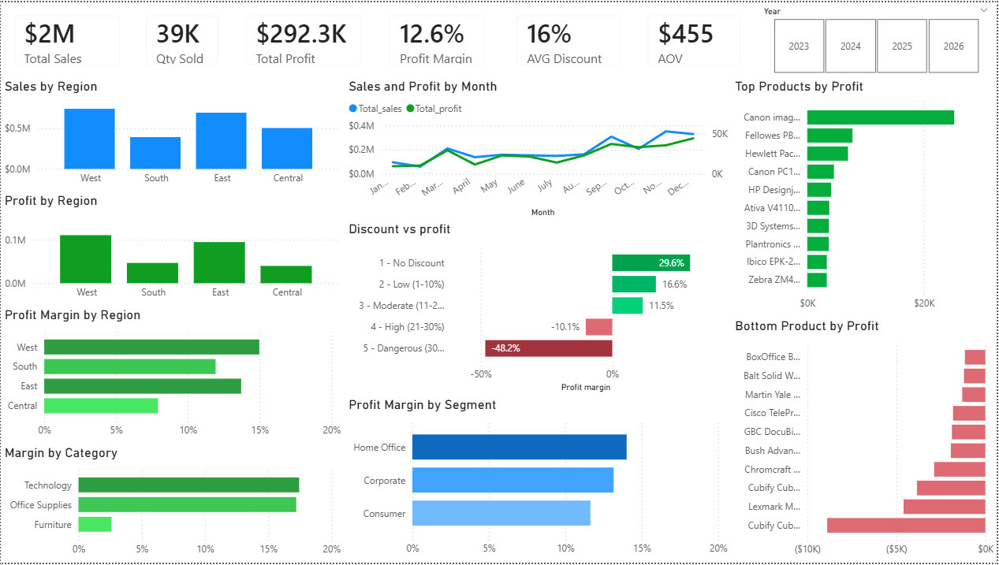
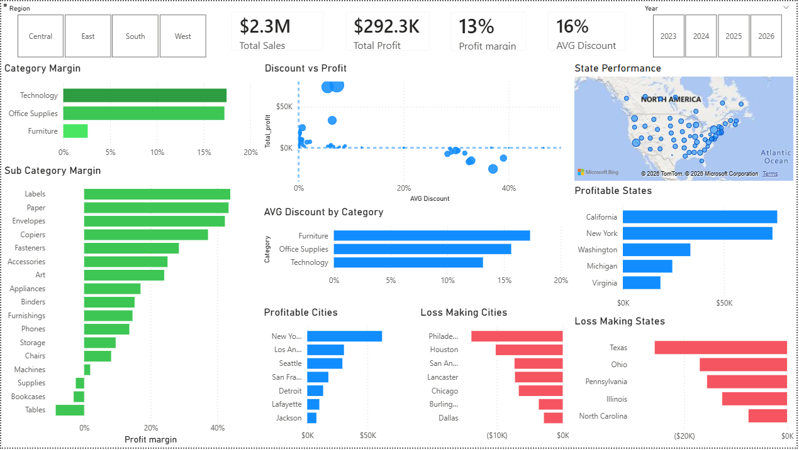

# Retail Business Performance Analysis — Superstore Dataset

An end-to-end data analysis project investigating why a US retail 
business generating $2.3M in revenue is only retaining 12.6% as 
profit — and what the business should do about it.

## Problem Statement

A US retail business operating across 4 regions — West, East, 
Central and South — is generating $2.3M in revenue but struggling 
to maintain healthy profit margins at only 12.6%.

The goal of this analysis is to identify:
- Which regions, categories and products are driving profit
- Which are destroying value and why
- What specific actions the business should take to improve profitability

## Tools Used

- **Python & Pandas** — Data cleaning and exploratory analysis
- **SQLite & SQL** — Business queries and deep dive analysis  
- **Power BI** — Interactive dashboard and visual storytelling
- **Jupyter Notebook** — Documentation of analysis process
- **GitHub** — Version control and project showcase

## Dataset

- **Source:** Sample Superstore Dataset — Availabe on Kaggle
- **Rows:** 10,194 orders
- **Columns:** 21 features
- **Period:** 2023 to 2026
- **Geography:** United States (49 states)
- **Key Fields:** Region, Category, Sub-Category, Sales, Profit, 
  Discount, Quantity, Ship Mode, Segment

## Key Business Findings

1. **Central region has the worst profit margin at 7.92%** — despite 
   being 3rd highest in sales. Excessive discounting average 24% 
   is the root cause.

2. **Furniture is structurally unprofitable across all regions** — 
   losing $2,802 in Central region alone. Even in the best case (South region) 
   profit margin is only 5.7%.

3. **Discount is the single biggest driver of losses** — orders with 
   0% discount achieve 29.6% profit margin while orders above 30% discount 
   lose 48.2% on every sale.

4. **Texas is the single biggest loss making state at -$25,729** — 
   with average discounts of 37% across all shipping modes.

5. **Revenue grew 50% from 2023 to 2026 but profit margin stayed 
   flat at 10-13%** — the business is scaling without fixing its 
   underlying profitability problems.

6. **Home Office is the most efficient segment at 14% margin** — 
   despite being the smallest by revenue.

7. **Technology drives all profitability** — Canon imageCLASS copier 
   alone generates $25,199 profit while Furniture products dominate 
   the loss makers list.

## Business Recommendations

1. **Cap discounts at 20% company wide** — data shows losses begin 
   at 21-30% discount band and become catastrophic above 30%.

2. **Investigate Furniture pricing strategy** — structurally low 
   margins across all regions suggest either production costs are 
   too high or pricing is too low.

3. **Prioritize Texas and Ohio for immediate action** — these 
   two states alone account for the largest losses in the business.

4. **Protect and grow Technology category** — highest and most 
   consistent margins across all regions and segments.

5. **Focus acquisition efforts on Home Office segment** — smallest 
   but most efficient segment with best margin at 14%.

## Dashboard Screenshots
### Page 1 — Business Overview

### Page 2 — Regional Analysis

## Project Structure

retail-business-analysis/

├── superstore_analysis.ipynb      # Python & Pandas analysis

├── superstore_sql.ipynb           # SQL queries & findings

├── superstore.pbix                # Power BI dashboard

└── README.md                      # Project documentation

## How To Run This Project

### Python Analysis
1. Clone this repository
2. Open `superstore_analysis.ipynb` in Jupyter Notebook
3. Run all cells in order

### SQL Analysis
1. Open `superstore_sql.ipynb` in Jupyter Notebook
2. Run all cells in order
3. SQLite database will be created automatically

### Power BI Dashboard
1. Download `superstore.pbix`
2. Open in Power BI Desktop
3. Dataset is embedded — no additional setup needed
